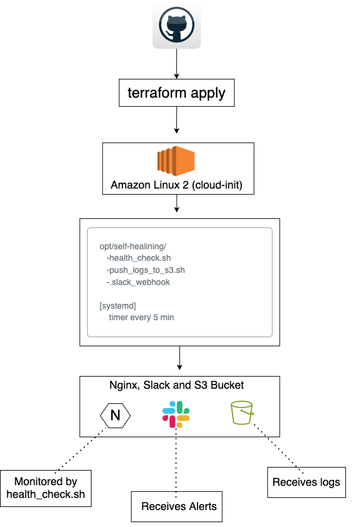

# 🚑 Self-Healing EC2

A cloud server that monitors itself every few minutes, restarts if something breaks, sends alerts to Slack, and backs up logs to S3 — all automated with Terraform and Bash.

---

## 🛠️ Built With

- **Terraform** – EC2, Security Groups, IAM Roles, S3 Bucket
- **EC2** – Virtual machine monitored & healed automatically
- **cloud-init** – Bootstraps `/opt/self-healing/` at launch
- **Bash** – Health checks, logging, alerting, S3 uploads
- **systemd** – Native Linux timers for health checks
- **Slack Webhooks** – Sends alerts
- **AWS SSM** – Injects secrets securely
- **IAM Role** – Allows EC2 to access S3 securely
- **S3** – Stores logs remotely

# 🚑 Self-Healing EC2

A cloud server that monitors itself every few minutes, restarts if something breaks, sends alerts to Slack, and backs up logs to S3 — all automated with Terraform and Bash.

---

## 🛠️ Built With

- **Terraform** – EC2, Security Groups, IAM Roles, S3 Bucket
- **EC2** – Virtual machine monitored & healed automatically
- **cloud-init** – Bootstraps `/opt/self-healing/` at launch
- **Bash** – Health checks, logging, alerting, S3 uploads
- **systemd** – Native Linux timers for health checks
- **Slack Webhooks** – Sends alerts
- **AWS SSM** – Injects secrets securely
- **IAM Role** – Allows EC2 to access S3 securely
- **S3** – Stores logs remotely

---

## 🔧 Features

- ✅ Monitors **Nginx** every 5 minutes
- ✅ Automatically **restarts Nginx** if it’s down
- ✅ Sends **Slack alerts** if failure is detected
- ✅ Logs every check to `/var/log/uptime.log`
- ✅ Pushes logs to **Amazon S3**
- ✅ Runs all provisioning with **Terraform**
- ✅ Injects secrets securely with **AWS SSM**
- ✅ Uses **systemd** (not cron) for reliable scheduling
- ✅ Comes with optional `deploy.sh` / `destroy.sh` to automate everything

---

## 📊 Architecture



---

## 📁 Folder Structure
```
self-healing-ec2
├── infra
│   ├── deploy.sh
│   ├── destroy.sh
│   ├── main.tf
│   ├── outputs.tf
│   ├── terraform.tfstate
│   ├── terraform.tfstate.backup
│   └── variables.tf
├── notes.md
├── README.md
├── scripts
│   ├── cloud-init.sh
│   ├── health_check.sh
│   └── push_logs_to_s3.sh
└── terraform.tfstate
```
---

## 🚀 Deployment

### Manual

```bash
terraform init
terraform apply -var="key_name=self-healing-ec2"
```
### Automated
```
./deploy.sh
```
### This script:
	•	🔐 Exports Slack webhook from SSM
	•	🧩 Injects it into Terraform as a variable
	•	⚙️ Applies Terraform config
	•	🕒 Waits for EC2 to boot and send initial Slack alerts

---
## 🧠 How It Works

**At Launch**

-	cloud-init.sh installs Nginx
-	Downloads Slack webhook from SSM
-	Creates /opt/self-healing/ with health check scripts
-	Sets up a systemd timer to run every 5 minutes

**Every 5 Minutes**

*health_check.sh runs:*
- 	✅ If Nginx is healthy → logs success
- 	❌ If Nginx is down → restarts it, logs failure, sends Slack alert

**On Demand**

-	push_logs_to_s3.sh uploads /var/log/uptime.log to S3

---

**🔐 Security Design**

	-	✅ No hardcoded secrets in Git, EC2, or cloud-init.sh
	-	🔐 Slack webhook is stored in AWS SSM Parameter Store as a SecureString
	-	📥 EC2 fetches the webhook securely during launch
	-	🛡 EC2 uses an IAM Role (with AmazonS3FullAccess) to upload logs
	-	🧑‍💻 Optional: Disable SSH and use SSM Session Manager for access
